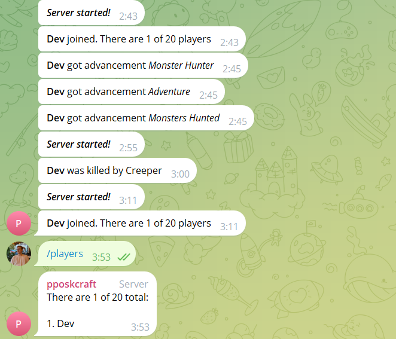

# TelegramChain

A small mod for forwarding messages from Telegram to the server and back

## Features:
- Server ➡ Telegram:
- - Chat messages
- - Advancement messages
- - Death messages
- - Player join/disconnect event
- - Server started event
- - (if FTBQuests installed) Quest completed event
- Telegram ➡ Server
- -  Chat messages
- - /players command to list players on server

Everything is customizable in config

---

## Setup

1. Add mod to your server
2. Start server to create config (`telegram_chain-common.toml`)
3. Create new bot with [BotFather](https://t.me/BotFather)
4. Add your bot to your chat
5. Open config and set variables:
* `telegramBotToken` - bot token (remember that one bot can only be used with one server)
* `telegramChatId` - chat id
* `telegramThreadId ` - thread id (if chat with topics used)
* play with other variables if needed
6. Start server and enjoy!

